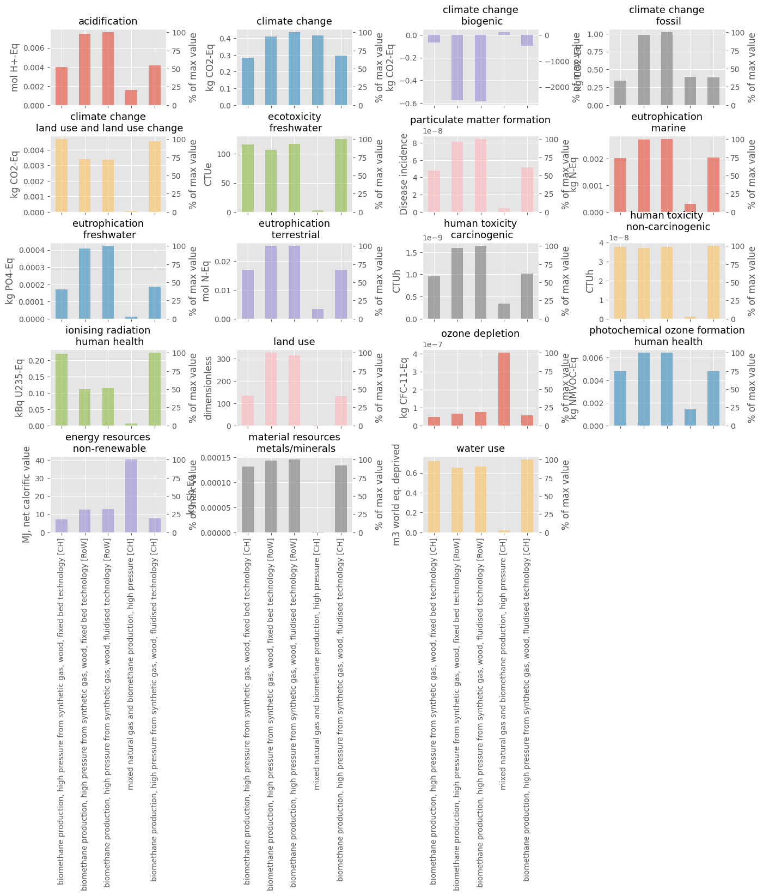
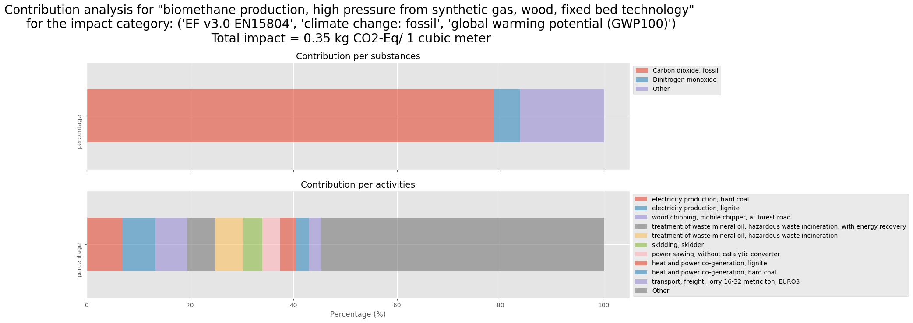

# Database explorer

## Description
Database explorer is a toolbox designed to help explore and analyze the content of a database on a given topic.

This toolbox includes functions to:
- explore the datasets contained into a database
- analyze the difference between those datasets in terms of inventories and impacts
- do some contribution analysis in terms of substances and processes (however, we lose the tree representation on these graphs)
- get an interactive dashboard to analyze the impact chain of an activity. You then get sunburst representations of respectively positive and negative impacts. Those positive and negative impacts are also represented on a waterfall. Finally, you also have an interactive sankey diagram.

## How to use it
An example notebook named "sandbox_bw25.ipynb" can be used to get started with the functionalities of dbex! 

P.S.: Originaly, functionalities were developed for brithway2 and relied on lca_algebraic, but we then switch to brightway25 and removed the reliance on lca_algebraic.

## Links to the code and visualization

An [simplified online version](http://alfalcadataviz.pythonanywhere.com/) is available to see the dashboard.

You can find below some data visualization realised with the dbex toolbox.

A graph for a simple comparison of carbon footprint:

A graph for a multricriteria LCA comparison:

A graph for contribution analysis by susbtances and processes:

And finally, an amazing interactive dashboard!!

The dashboard function is taking a very very long time to run due the adapted GraphTraversal function that should not take that long. So there is a huge potential to improve the calculation and also the features of the vizualisation!

To see the result without the need to run the code, you can visit http://alfalcadataviz.pythonanywhere.com/

## License
[MIT License](https://github.com/RomainBes/DataVizChallenge/blob/main/LICENSE.md)

