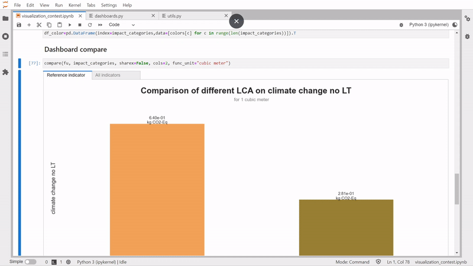
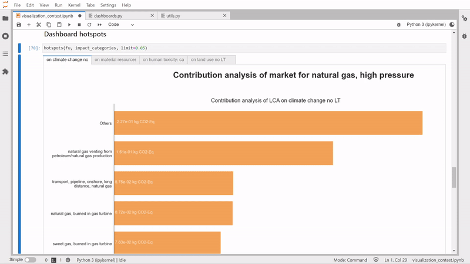
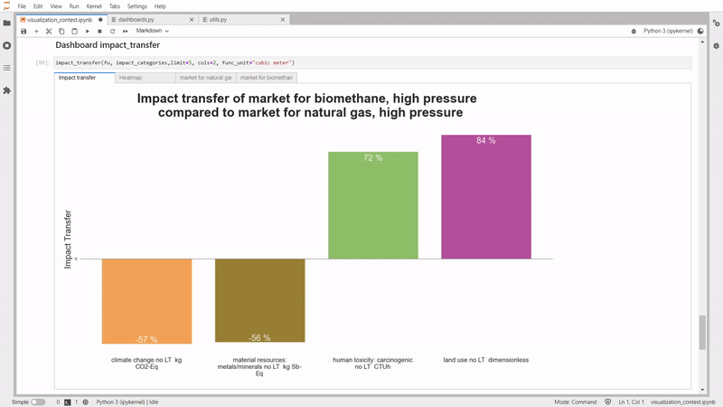

# Compare plot

## Description
This tool is designed to provide several easy-to-understand graphics for everyday LCA practitioners to quickly analyze their LCA results in Brightway.
The visualizations provided are direct or indirect outcomes from the scientific paper ["Investigating Product Designer LCA Preferred Logics and Visualizations" Maud Rio, Florent Blondin, Peggy Zwolinski, Procedia CIRP, 2019, ISSN 2212-8271, https://doi.org/10.1016/j.procir.2019.04.293](https://www.sciencedirect.com/science/article/pii/S2212827119309412)

## How to use it
```python
from bw_visualization.compare_plot import plot

import bw2data as bd
import bw2io as bi

bd.projects.set_current("graphics-fixture")
bi.useeio11()

eidb = bd.Database('USEEIO-1.1')

window_metal=next(node for node in db_USLCI if node['type'] == 'product' if node['name']=="Metal windows, doors, and architectural products; at manufacturer")
window_wood=next(node for node in db_USLCI if node['type'] == 'product' if node['name']=="Wooden windows, door, and flooring; at manufacturer")

fu={window_metal: 1, window_wood: 1}

CC = [method for method in bd.methods if "IPCC 2021" in str(method) and "GWP100" in str(method)][0]
ADP = [method for method in bd.methods if "ADP" in str(method) if "ultimate reserves" in str(method) if 'EF v3.1 no LT' in str(method)][0]
TOX = [method for method in bd.methods if "human toxicity: carcinogenic no LT" in str(method) if 'EF v3.1' in str(method)][0]
LU = [method for method in bd.methods if 'land use no LT' in str(method) if 'soil quality index' in str(method) if 'EF v3.1' in str(method)][0]

impact_categories = [CC, ADP, TOX, LU]

result = plot(fu, impact_categories, reference_category=CC, func_unit="cubic meter")
```

## Visualization

It works also with Ecoinvent database, and it could be updated for any database.

compare:



hotspots:



impact_transfer:



## Reference
[https://github.com/teolvs/lca_graphic](https://github.com/teolvs/lca_graphic)
