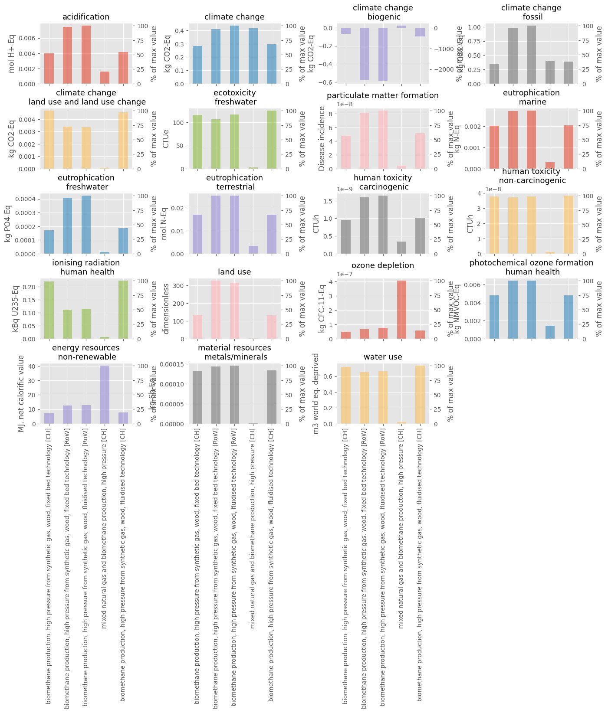
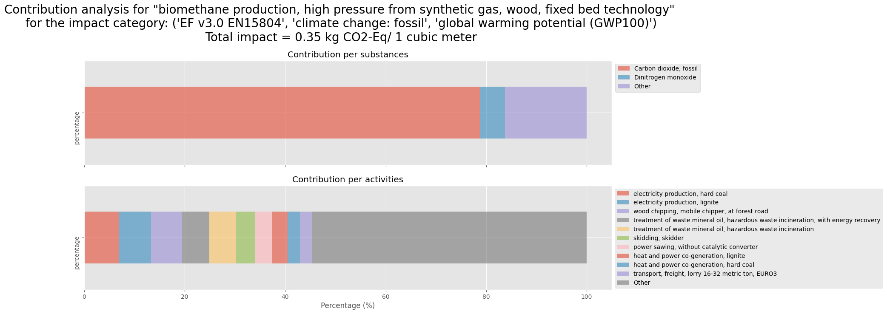

# Database explorer

## Description
Database explorer is a toolbox designed to help explore and analyze the content of a database on a given topic.

This toolbox includes functions to:
- explore the datasets contained into a database
- analyze the difference between those datasets in terms of inventories and impacts
- do some contribution analysis in terms of substances and processes (however, we lose the tree representation on these graphs)
- get an interactive dashboard to analyze the impact chain of an activity. You then get sunburst representations of respectively positive and negative impacts. Those positive and negative impacts are also represented on a waterfall. Finally, you also have an interactive sankey diagram.

## How to use it
```python
from bw_visualization.database_explorer import plot

import bw2data as bd
import bw2io as bi

bd.projects.set_current("E3_database_bw25")
eidb = bd.Database('ecoinvent 3.7 cut-off')

methods_EF = [
    m
    for m in bwd.methods
    if "EF v3.0 EN15804" in str(m)
    and not "no LT" in str(m)
    and not "obsolete" in str(m)
]
methods_CC = [m for m in methods_EF if "climate" in str(m)]
method_CC = methods_CC[0]

result = plot(database=eidb, name="biomethane production", methods_ef=methods_EF, methods_cc=methods_CC, i=0, method=method_CC, cutoff=0.02, unit='cubic meter')
```

## Visualization

You can find below some data visualization realized with the dbex toolbox.

A graph for a simple comparison of carbon footprint:


A graph for a multi criteria LCA comparison:



A graph for contribution analysis by substances and processes:



And finally, an amazing interactive dashboard!!


The dashboard function is taking a very very long time to run due the adapted GraphTraversal function that should not take that long. So there is a huge potential to improve the calculation and also the features of the visualization!

## Reference
[https://github.com/RomainBes/DataVizChallenge](https://github.com/RomainBes/DataVizChallenge)
