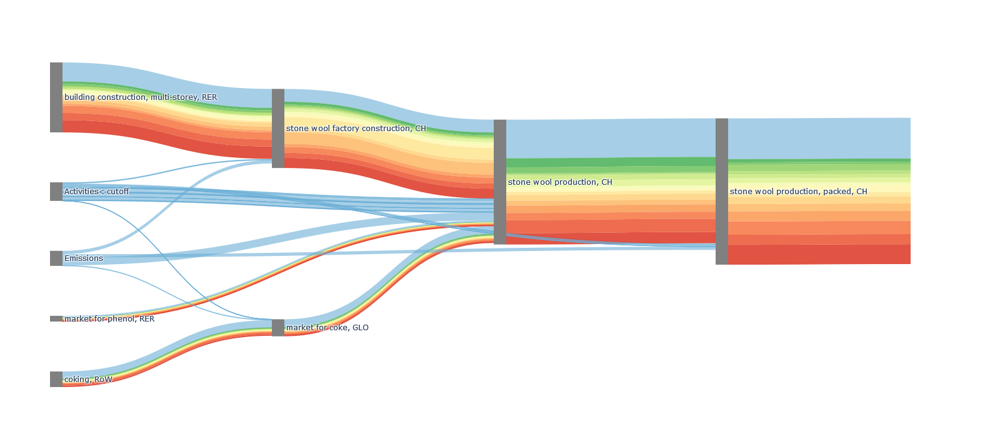

# Sankertainpy

## Description

sankertainpy is using an adjusted version of the [bw2analyzer function "recursive_calculation_to_object()"](https://github.com/brightway-lca/brightway2-analyzer/blob/main/bw2analyzer/utils.py) to generate the plotly compatible graph traversal LCA data. With the function generate_sankey(), direct emission impact is calculated, flows smaller than the cutoff value are bundled to single nodes, and the uncertainty visualization is generated. It is tested with brightway2 and ecoinvent 3.8 cut-off.
Inspired by the paper [*"Visualization approaches for understanding uncertainty in flow diagrams" from Vosough et al (2019)](https://doi.org/10.1016/j.cola.2019.03.002)

## How to use it
```python
from bw_visualization.sankertainpy import plot

import bw2data as bd
import bw2io as bi

bd.projects.set_current("graphics-fixture")
bi.useeio11()

eidb = bd.Database('USEEIO-1.1').random({"name": "Cutlery and handtools; at manufacturer",
                                         'code': '1fb0a77a-d49c-3557-810c-a4db0e73bab6'})
method = bd.methods.random()
result = plot(eidb, method)
result.show()
```

## Visualization

snakertrainpy example:



## Reference
[https://github.com/HaSchneider/sankertainpy](https://github.com/HaSchneider/sankertainpy)
