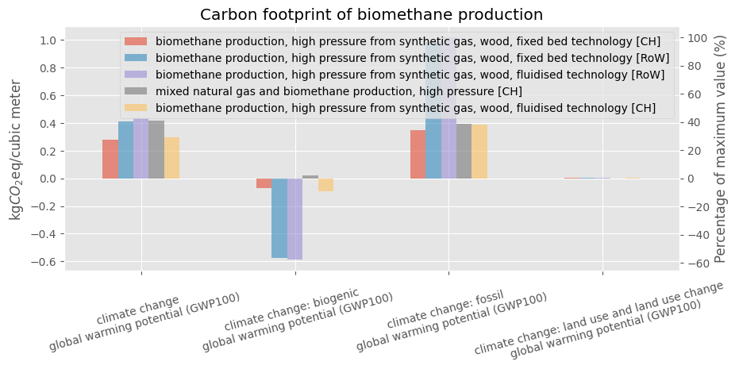
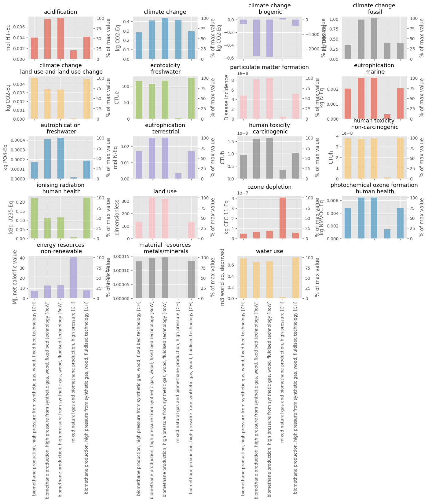
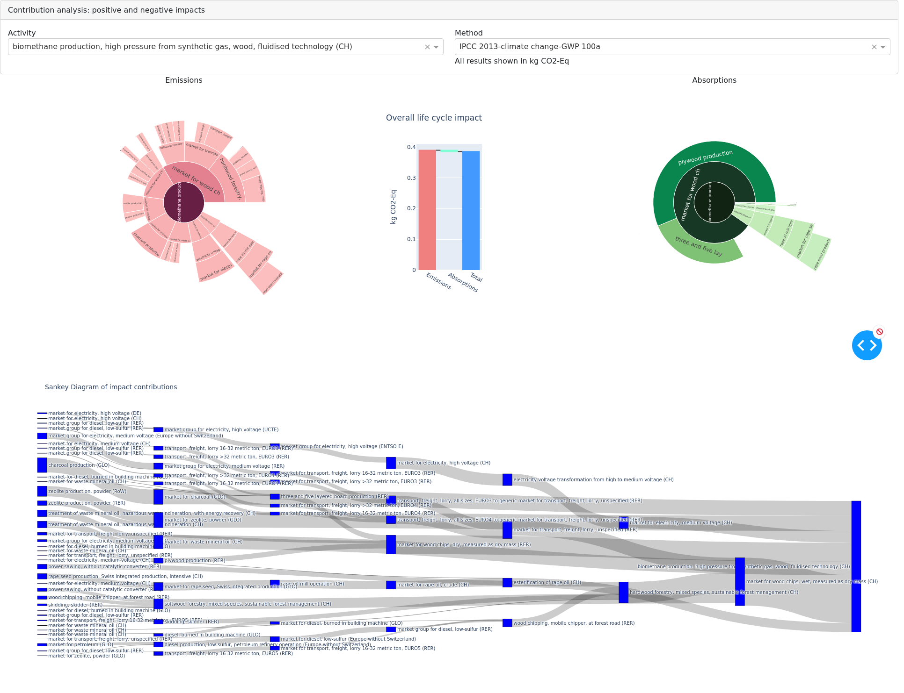
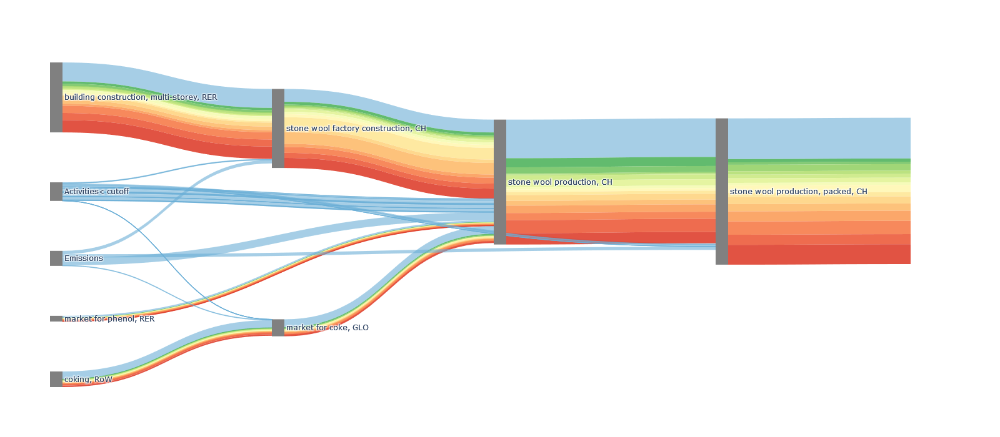

# Usage

# Database explorer

### Description
Database explorer is a toolbox designed to help explore and analyze the content of a database on a given topic.

This toolbox includes functions to:
- explore the datasets contained into a database
- analyze the difference between those datasets in terms of inventories and impacts
- do some contribution analysis in terms of substances and processes (however, we lose the tree representation on these graphs)
- get an interactive dashboard to analyze the impact chain of an activity. You then get sunburst representations of respectively positive and negative impacts. Those positive and negative impacts are also represented on a waterfall. Finally, you also have an interactive sankey diagram.

### How to use it
An example notebook named "sandbox_bw25.ipynb" can be used to get started with the functionalities of dbex! 

P.S.: Originaly, functionalities were developed for brithway2 and relied on lca_algebraic, but we then switch to brightway25 and removed the reliance on lca_algebraic.

### Links to the code and visualization

An [simplified online version](http://alfalcadataviz.pythonanywhere.com/) is available to see the dashboard.

You can find below some data visualization realised with the dbex toolbox.

A graph for a simple comparison of carbon footprint:



A graph for a multricriteria LCA comparison:



A graph for contribution analysis by susbtances and processes:


And finally, an amazing interactive dashboard!!



The dashboard function is taking a very very long time to run due the adapted GraphTraversal function that should not take that long. So there is a huge potential to improve the calculation and also the features of the vizualisation!

To see the result without the need to run the code, you can visit http://alfalcadataviz.pythonanywhere.com/

# Compare plot

### Description
This tool is designed to provide several easy-to-understand graphics for everyday LCA practionners to quickly analyze their LCA results in Brightway. 

The [utils.py](https://github.com/teolvs/lca_graphic/blob/main/utils.py) file gives useful tool for quickly LCA computations and analyse of the contributions.
The [dashboards.py](https://github.com/teolvs/lca_graphic/blob/main/dashboards.py) provides the methods to gather all the results into three dashboards :
1. ```compare``` to compare LCA results in different impact categories on the one hand,
2. ```impact_transfer``` to plot the variations of the contribution of the top processes (for the reference method) for each impact category to identify the impact transfers,
3. ```hotspots``` to analyze the contributions of each activity in different impact categories on the other hand.

All these methods are generated all at once in the method ```lca_graphic```

The visualisations provided are direct or indirect outcomes from the scientific paper "Investigating Product Designer LCA Preferred Logics and Visualisations" Maud Rio, Florent Blondin, Peggy Zwolinski, Procedia CIRP, 2019, ISSN 2212-8271, https://doi.org/10.1016/j.procir.2019.04.293. (https://www.sciencedirect.com/science/article/pii/S2212827119309412)

### Installation
The library works with the open-source US EEIO database [US EEIO table](https://github.com/USEPA/USEEIO), and [available here (115MB download)](https://files.brightway.dev/visualization_example_data.zip). 

It works also with Ecoinvent database, and it could be updated for any database.

An example of the practical use of our tools can be found in the following [notebook]. Unfortunately, dashboards do not appear in the Github. Thus, the code should be executed on an Jupyter Notebook to see the dashboards for real. Brightway2.5 is required.

[notebook]: https://github.com/teolvs/lca_graphic/blob/main/visualization_contest.ipynb 

# Sankertainpy

### Visualize uncertainty with sankey diagrams.


This is a python package written for the depart de sentier [Sustainability assessment visualization contest](https://github.com/Depart-de-Sentier/visualization-contest-2022) to visualize brightway2 Monte Carlo LCA results with [plotly sankey diagrams](https://plotly.com/python/sankey-diagram/). sankertainpy is using an adjusted version of the [bw2analyzer function "recursive_calculation_to_object()"](https://github.com/brightway-lca/brightway2-analyzer/blob/main/bw2analyzer/utils.py) to generate the plotly compatible graph traversal LCA data. With the function generate_sankey(), direct emission impact can be calculated, flows smaller than the cutoff value are bundled to single nodes, and the uncertainty visualisation is generated. It is tested with brightway2 and ecoinvent 3.8 cut-off.  



### Getting started:

Clone the repository and start:


```python
import bw2data as bd
from bw_to_plotly import recursive_calculation_to_plotly
import sankertainpy as sc
activity= bd.Database('database name').random()
method= bd.methods.random()
result = recursive_calculation_to_plotly(activity,method)
fig= sp.generate_sankey(result, type=1)
fig.show()
```
Note: depending on the number of monte carlo iterations and the level depth, the calculation can take some time!

### Background:

Inspired by the paper *"Visualization approaches for understanding uncertainty in flow diagrams"* from Vosough et al (2019):
https://doi.org/10.1016/j.cola.2019.03.002
